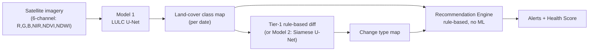

# Watershed Signal

**Application of Geospatial Techniques for Visualization and Analysis to Interpret Geo-Coded Images to Enhance Watershed Development Outcomes**

Built for **Smart India Hackathon 2026 — PS-26015**, sponsored by the Ministry of Rural Development (Software track, Disaster Management theme).

Watershed Signal watches any watershed from free satellite imagery and answers, automatically: what's on the ground right now, what changed since a previous date, and what a field officer should go check — without needing a site visit to find out.

---

## The problem

India runs large watershed-development programs — check dams, percolation tanks, afforestation — across thousands of drought-prone rural sites. Once built, verifying whether a structure is still working, whether the land is recovering, or whether someone has encroached on protected watershed land currently relies on manual field visits: slow, expensive, and impossible to do continuously at national scale.

## What it does

1. **Land cover classification** — labels every ~10m patch of a watershed as water, dense vegetation, agriculture, sparse vegetation, barren/degraded land, built-up, or fallow.
2. **Change detection** — compares two dates of the same site: a new water body (positive — a structure worked), new construction (possible violation), vegetation/water loss (degradation, needs intervention), or vegetation gain (improvement).
3. **Recommendations** — plain-language, rule-based alerts ("Possible unauthorized construction detected — recommend field verification") that trace back to a specific, auditable reason — not a black-box output.

## Architecture



No model predicts recommendations directly — that's deliberate. No dataset exists for it, and a black-box "do X" output wouldn't be trusted or adopted by a government official. Two focused, inspectable models feed transparent if-then rules instead.

| Component | Predicts | ML? |
|---|---|---|
| Model 1 — U-Net (ResNet18 encoder) | Land-cover class per pixel, single date | Yes |
| Tier-1 diff / Model 2 (Siamese U-Net) | Change type per pixel, between two dates | No / Yes |
| Recommendation Engine | Alerts + suggested actions | No — pure rule-based logic |

## Results

Model 1 trained on a pool of 4 real sites (chosen to cover classes any single site lacked — see [documentation.md](documentation.md) for how each was picked and verified):

| Site | Why it's in the training pool |
|---|---|
| Kadwanchi Watershed, Jalna, Maharashtra | Primary site — real Indo-German Watershed Development Programme project (1888 ha), actual check dams/percolation tank |
| Tamhini Ghat, Pune, Maharashtra | Fixed a near-total dense-vegetation gap (63% tree cover here) |
| Donimalai Mine, Ballari, Karnataka | Fixed a near-total barren-land gap (4.5% exposed ground here) |
| Jayakwadi Dam / Godavari river, Paithan, Maharashtra | Fixed river/large-water tracing (49% water here; added after a live unseen-location query failed on a real river) |

Latest Colab retrain (class-weighted loss + mean-IoU checkpoint selection, leak-free spatial-block split, corrected full-extent Kadwanchi data):

**Mean IoU: 49.1%** · **Pixel accuracy: 78.2%** — per-class IoU: water 82.5%, agriculture 71.2%, dense vegetation 66.8%, sparse vegetation 49.1%, barren 35.9%, built-up 30.4%, fallow 7.5% (recovered from a 0.000 collapse under the old unweighted loss; fallow remains the hardest class). See [documentation.md](documentation.md) section 9 for the full history, including the superseded 65.9%/81.2% baseline from before the split/coverage corrections.

Before pooling in the auxiliary sites, dense vegetation and barren land scored **0.004 and 0.000 IoU** — complete failures, from having almost no training examples. See [documentation.md](documentation.md) for the full before/after story, including the two mistaken guesses (Anantapur city, the Chambal ravine belt) that didn't pan out before Donimalai did.

## Apps & User Interfaces

Watershed Signal provides two complementary interfaces:

1. **Modern Next.js Web GIS (`web/`)**: A production-grade web application featuring:
   - **Interactive GIS & Telemetry**: 3D WebGL satellite globe, Leaflet/MapLibre dynamic layers, and real-time Copernicus DEM catchment & stream overlays.
   - **7-Tab Analytics Suite**:
     - *Land Cover*: Split-slider comparing T1 vs. T2 classified rasters with per-class hectares.
     - *Change*: Structural change tracking with seasonal-crop informational banner.
     - *Health & Alerts*: 4 sub-index diagnostics (Water Storage, Canopy & Biomass, Soil Stability, 5-Yr Resilience), alert cards, formula accordion, and link to the Simulator.
     - *Map*: Leaflet/DEM catchment layer.
     - *Field Investigation*: Ground truth verification with **photo-availability integrity** — stations without attached photos are tagged with "Why Field Verification is Needed" (optical sensor limitations) and "What On-Ground Inspection Will Uncover" (physical measurement protocols). Official "Confirmed Match" verdict is disabled until photo evidence is provided.
     - *Investigation*: Dynamic catchment diagnostic with "What is Changed / Affected" pillars and "Recommended Engineering Changes" (all coordinates AOI-clamped via `clampToAoi()`).
     - *What-If Simulator*: Dedicated standalone policy simulator with 4 intervention sliders, 1-click strategy presets, live ecological metric recalculation, land cover transition matrix, and ROI projection.
   - **Live Satellite Analysis**: Enter any place name in India or custom coordinates; triggers live Sentinel-2 STAC queries, GPU U-Net inference, and DEM flow-routing with a live radar scanner and progress tracker.
   - **Zero Emojis**: All icons are `@phosphor-icons/react` SVG — zero unicode emojis in the entire codebase.
2. **Python Streamlit Dashboard (`project/app/`)**: A companion exploratory workbench (`streamlit_app.py`) for data science inspection, training checkpoint evaluation, and batch analysis.

---

## Performance & Caching Architecture

| Stage | Optimization | Latency |
| :--- | :--- | :--- |
| **Model 1 U-Net Inference** | PyTorch 2.6.0+cu124 on **NVIDIA GeForce RTX GPU** | **~0.42 s** (15x faster than CPU) |
| **Copernicus 30m DEM** | Windowed HTTP range reads on Cloud-Optimized GeoTIFFs (COGs) | **2.49 s** fresh / **0.02 s** cached |
| **Sentinel-2 Bands (B02-B08)** | Multi-threaded parallel streaming via `ThreadPoolExecutor` | **~12–15 s** total download |
| **Repeat Location Queries** | **Two-Tier Cache** (Disk COG rasters + In-Memory/Redis metadata) | **29.2 ms** (`[Cache HIT]`) |

---

## Getting started

### 1. Run the Python API Bridge
The API server exposes REST endpoints (`/api/health`, `/api/pipeline/run`, `/api/interventions`, `/api/field-log`, `/api/sites/:siteKey`) on port 8000:

```bash
cd project
uv run python app/api_server.py
```

### 2. Run the Next.js Frontend
Open a second terminal to launch the web client on `http://localhost:3000`:

```bash
cd web
npm install
npm run dev
```

### 3. (Optional) Run the Streamlit Dashboard
```bash
cd project
uv run streamlit run app/streamlit_app.py
```

## Data sources

| Data | Source | Access |
|---|---|---|
| Satellite imagery | Sentinel-2 L2A, via Earth Search STAC (AWS Open Data) | Free, automatic, any coordinates |
| Training labels (in use) | ESA WorldCover 10m | Free, automatic, any coordinates |
| Training labels (planned upgrade) | Bhuvan LULC (ISRO/NRSC), India-specific | Needs registration |
| Place search | OpenStreetMap Nominatim | Free, no API key |

## Repository structure

```
watershed/
├── 26015.pdf              # official PS-26015 problem statement
├── model_plan.md           # original technical architecture plan
├── dataset.md               # data-sourcing notes
├── documentation.md         # full project record: decisions, bugs found, results
├── needed_inputs.md         # what's needed from the user, ranked by impact
├── CLAUDE.md                 # working rules for AI-assisted development on this repo
└── project/
    ├── notebooks/            # watershed_pipeline.ipynb (generated by build_notebook.py)
    ├── src/                  # config, data pipeline, models, evaluation, rule engine
    ├── app/                  # Streamlit app (streamlit_app.py, design.py, aoi_picker.py)
    ├── data/                 # pipeline data (gitignored — regenerated by the scripts)
    ├── models/               # trained checkpoints (gitignored — see documentation.md)
    └── outputs/              # generated figures/maps (gitignored)
```

## Status and roadmap

Working end-to-end: trained pipeline, rule-based change detection and alerts, live app with location search, watershed boundary/drainage delineation, intervention registry, dedicated policy simulator, dynamic catchment investigation with engineering recommendations, and geo-tagged photo field verification with ground-truth integrity (photo required before certifying AI-matches-ground claims). See [needed_inputs.md](needed_inputs.md) for what's still needed (real Bhuvan labels, real field photos) and [documentation.md](documentation.md) for the complete history of decisions, bugs found and fixed, and verification notes.

## License

Not yet chosen.
